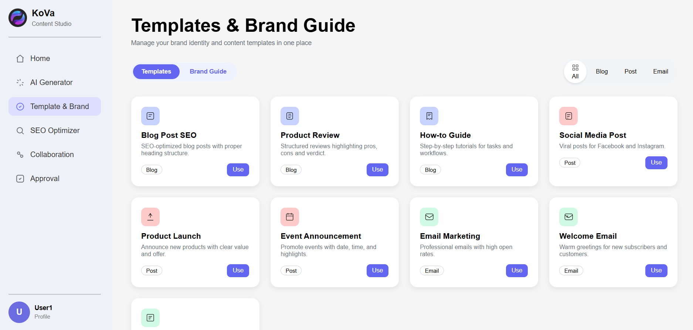
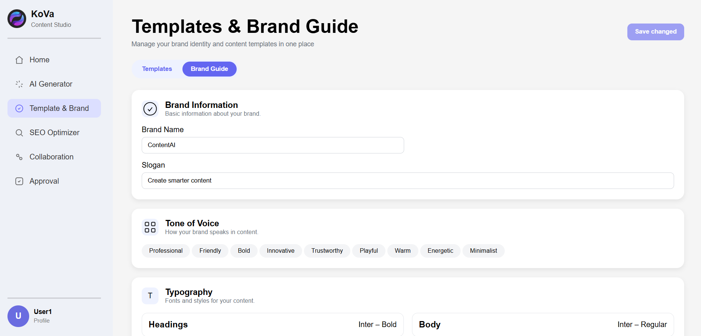
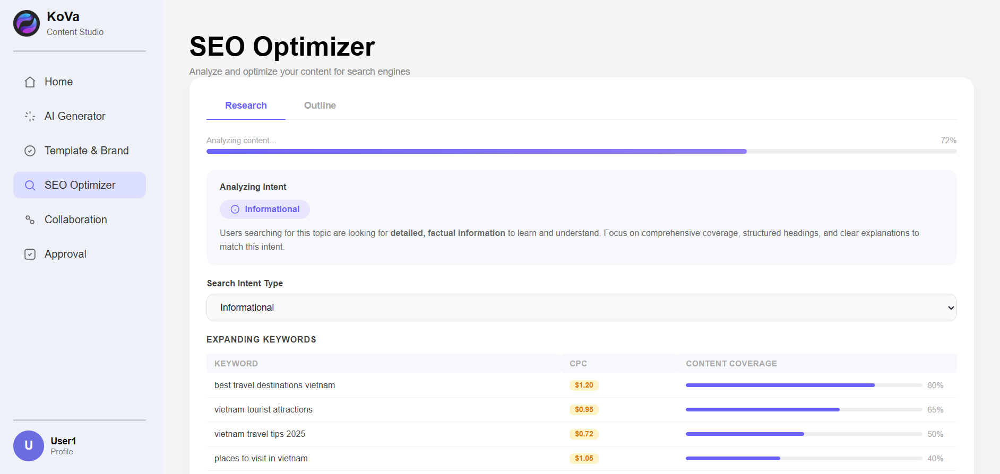
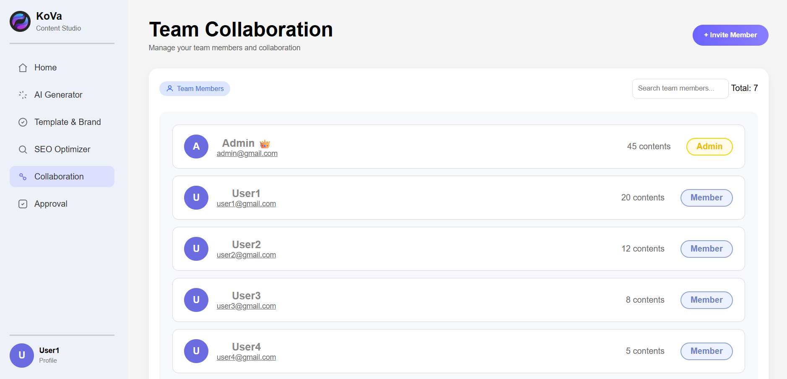
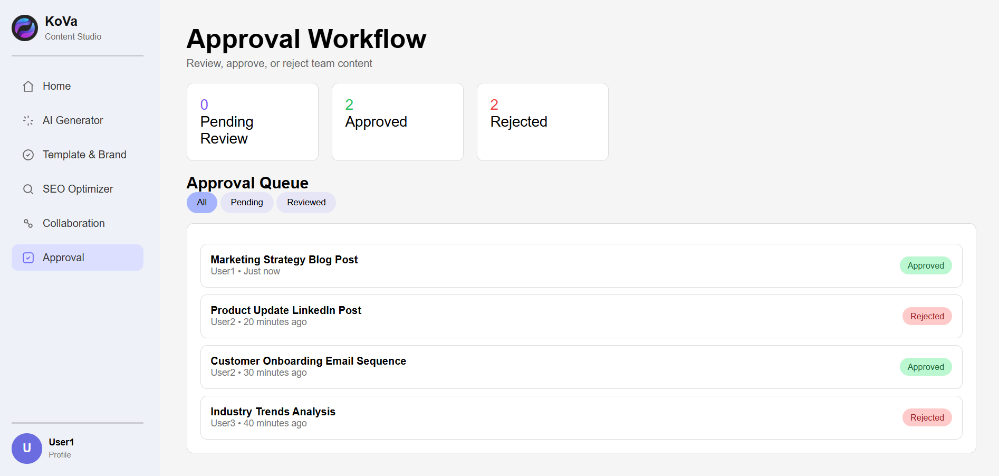

# Generative AI Content Platform (GACP)

## Authors
- Phan Xuân Phương Ngân (Leader)
- Hoàng Thị Minh Ngọc
- Trần Ngọc Phương Nghi
- Đoàn Phan Linh Nhi

---

## Project Description
The Generative AI Content Platform is an enterprise-oriented application designed to help individuals and businesses create content quickly, consistently. The platform leverages Generative AI to support content creation for marketing, branding, and communication purposes. 
This system allows users to generate various types of content such as blog articles, social media posts, and email marketing campaigns while ensuring brand consistency and SEO optimization. 
In addition, it supports collaboration and approval workflows, making it suitable for team-based content production.

---

## Project Objectives
- Build a web application that integrates Generative AI for content creation
- Enable businesses to scale marketing content efficiently with personalization
- Ensure brand consistency through templates and brand-style guidelines
- Support SEO-optimized content to improve online visibility
- Facilitate collaboration and approval processes within content teams
- Ensure the system can run fully on local environment (localhost)

---

## Key Features

### AI Content Generation
- Generate content such as blog posts, social media captions, and email drafts
- Support customizable prompts to match different tones and purposes
- AI processing is handled via a local API

  

### Templates & Brand Style Guide
- Create and manage content templates
- Enforce brand voice, tone, and formatting consistency

  

  

### SEO Optimization
- Analyze generated content for SEO performance
- Provide keyword suggestions and optimization recommendations

  

### Collaboration & Approval Workflow
- Enable multiple users to collaborate on content
- Support content review, approval, and revision workflows

  

  

---

## Target Users
This platform is suitable for:
- Marketing teams
- Content creators and copywriters
- Small and medium-sized businesses
- Enterprises looking to scale content production
- Startups and digital agencies

---

## Technologies Used
- **Backend:** Python with Flask (RESTful API running on localhost)
- **Frontend:** HTML, CSS, Jinja2 Templates
- **AI Integration:** Generative AI (LLM-based content generation – local/offline or mocked API)
- **Database:** SQL Server
- **Development Tools:** Visual Studio Code, GitHub 

---

## Note
- The API is designed to run locally and is not deployed to a public server

---

## User Guide

### 1. User Authentication
- Register a new account or log in with an existing account

### 2. Content Creation
- Select a content type (blog, post, email)
- Choose a template and define the content requirements
- Generate content using AI

### 3. Editing & Optimization
- Edit generated content manually if needed
- Apply SEO optimization suggestions

### 4. Collaboration & Approval
- Share content with team members
- Submit content for review and approval

### 5. Content Publishing
- Export or publish approved content to desired platforms

---

## Conclusion
The Generative AI Content Platform aims to streamline the content creation process by combining artificial intelligence, workflow management, and SEO optimization.

It helps organizations reduce content production time while maintaining quality, consistency, and scalability.
